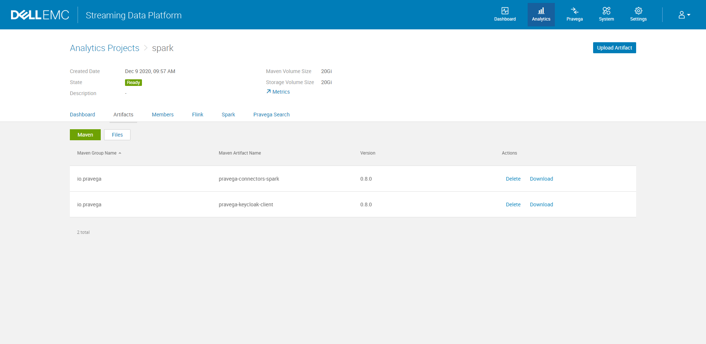
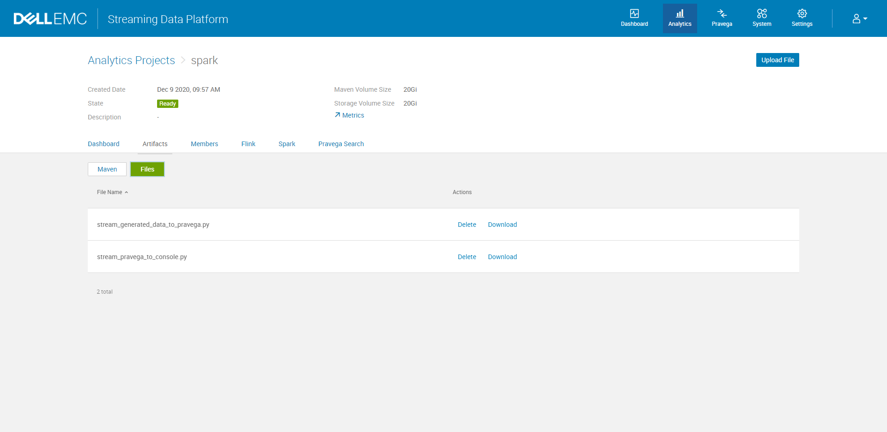

# Spark Connector Examples for Pravega on SDP

The battery of code examples to demonstrate the capabilities of Pravega as a data stream storage system for Apache Spark.

## Deployment

1. Create a project on SDP and upload the maven artifacts for [spark-connectors](https://github.com/pravega/spark-connectors) and [pravega-keycloak](https://github.com/pravega/pravega-keycloak) jar


2. Upload the Python or Scala application file to the SDP


3. Change any configurations such as spark version, dependencies, application name of the deployment `yaml` file

4. Use `kubectl` to deploy the application

```bash
kubectl apply -f generate_data_to_pravega.yaml -n namespace
kubectl apply -f pravega_to_console_python.yaml -n namespace
```